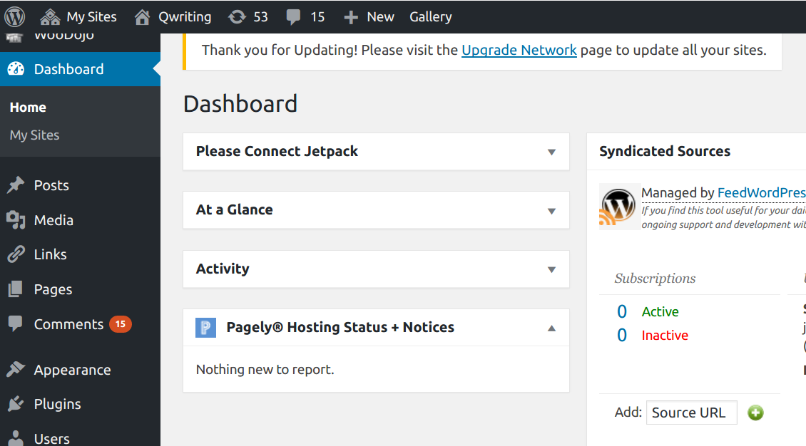

[<<< Previous](qwriting.md) | [Next >>>](posts.md)

# WordPress Fundamentals

## Logging In

Your WordPress site on QWriting has a public-facing section and a private section that allows you to determine the site's contents, look, and behavior. The URL for the public-facing site looks like this:

    <your-domain>.qwriting.qc.cuny.edu
	
The URL for the private-facing portion looks like this:	

    <your-domain>.qwriting.qc.cuny.edu/wp-admin
	
If you're not logged in when you go to this URL (or if you click the `login` button on the front page of your site), you will be presented with the WordPress login page: 

Enter your QWriting username and password to log in.

## The Dashboard

The private portion of your site is called the **dashboard**.

The dashboard allows you to create and edit posts, add users, change the theme, and otherwise control the behavior of your site. The major control categories appear in the gray bar on the left. The gray bar on the top allows you to choose which WordPress site you want to work with and also has a shortcut that allows you to immediately jump to creating a post.

## Posts and Pages

WordPress uses two basic types of content: **pages** and **posts**.

**Pages** are static content. If your site has a Syllabus section, an About section, or a Contact section, they will all be pages.

**Posts** are content designed to be ordered chronologically. Every time a new post is created, old posts will be pushed down on the blog. Student writing will usually be created as posts and not pages.

## Users

WordPress sites have a `Users` section that allows you to decide who has access to the blog and who has permission to read, create, and edit posts. The default roles are:

- Administrator
- Editor
- Author
- Contributor
- Subscriber

Subscribers can read posts on a private site and can't do much else.

Contributors can create posts on the site, but can't publish them without intervention from an editor.

Authors can create and publish their own posts on the site.

Editors can do everything authors can do, but in addition can edit and publish other people's posts.

Administrators can add new users and change site settings, as well as do anything an editor can. As a teacher, you will likely be an administrator on your site. You can also make particularly trusted students or assistants into additional administrators.

In some courses, it makes sense to make all students into authors and allow them to make and publish posts. In other cases, you will want to review posts before they are published—in these circumstances, you would make your students contributors and then manually approve their submissions in the dashboard.

[<<< Previous](qwriting.md) | [Next >>>](posts.md)
