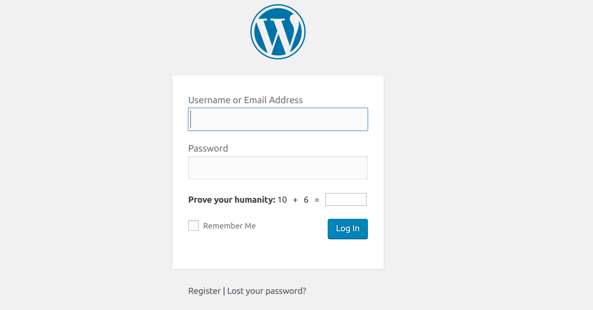

## WordPress fundamentals

### The Dashboard

Your WordPress site on QWriting has a public-facing section and a private section that allows you to determine the site's content, look, and behavior. The URL for the public-facing site looks like this:

    <your-domain>.qwriting.qc.cuny.edu
	
The URL for the private-facing portion looks like this:	

    <your-domain>.qwriting.qc.cuny.edu/wp-admin
	
If you're not logged in when you go to this URL (or if you click the `login` button on the front page of your site), you will be presented with the WordPress login page: 

Enter your QWriting username and password to log in.

### Posts and Pages

