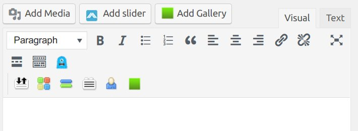

# Creating a New Post

1. Make sure you're [logged into Qwriting](http://qcvoices.qwriting.qc.cuny.edu/wp-login.php?redirect_to=http%3A%2F%2Fqcvoices.qwriting.qc.cuny.edu%2F).
2. Head to your admin panel (select your site from the dropdown on the gray bar on the top left).
3. On the top of the page, click the `+ New` button and select `Post` from the dropdown menu. 
4. Enter a title for your post. 
5. Use the visual editor (the large box in the center) to write your post. you may want to write the post locally on your computer and then paste it in and edit when you're done. You can also edit the raw HTML of the post by clicking the `Text` tab on the top right of the editing area. 
6. (optional) To add an image to the body of your post, click `Add Media` on the top left of the editing area. In the window that pops up, click `Upload file`. Drag a picture to the new window or click the `Select Files` button. When your picture is selected, click `Insert into post.` Finally, you're going to want to have your text wrapped to the left or right around your picture by clicking on the picture and selecting either `Align left` or `Align right`.     
7. Add a `Featured Image` to the post by clicking the `Featured Image` button on the far bottom right of the page. See optional adding photos step above for details on uploading photos. 
9. Once you're done writing and editing, click the `Preview` button on the right under the `Publish` heading. This will take you to a page that shows you how your post will appear. 
10. Finally, click `Publish` (the blue button on the right) once you're ready for your post to go live. 
